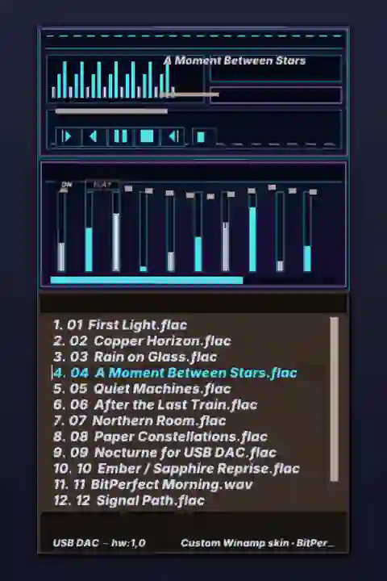
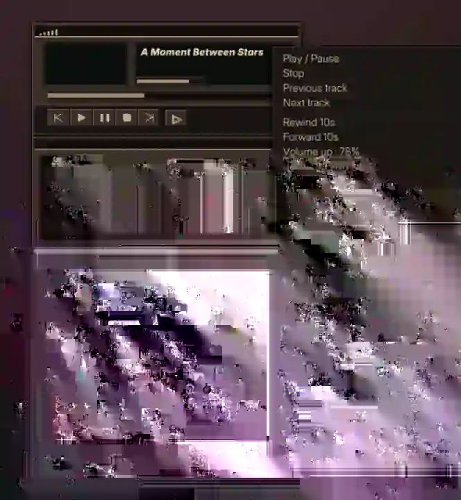

# 🎶 **aplay+**: A Simple and High-Quality Audio Player


[](https://github.com/yui0/aplay-/releases)
[](LICENSE)
[](https://github.com/sponsors/yui0)

🎧 **Enjoy BitPerfect audio playback with simplicity and precision!**


## 🖼️ Screenshots

<p align="center">
  
</p>

<p align="center"><em>Built-in Ember — warm charcoal, copper accents, live equalizer, and BitPerfect device status</em></p>

<table>
  <tr>
    <td align="center" width="50%">
      <br>
      <sub><b>Custom Winamp Classic skin</b> — Sapphire neon theme</sub>
    </td>
    <td align="center" width="50%">
      <br>
      <sub><b>Right-click controls</b> — playback, DSP, devices, skins, and display options</sub>
    </td>
  </tr>
</table>

These compact SVG assets contain optimized raster copies derived from captures
rendered by the real Luna/OpenGL application through the headless screenshot
runner in [`tools/screenshots`](tools/screenshots). Its minimal GLFW
compatibility layer uses surfaceless EGL, so regenerating the raw PNG captures
does not require GLFW development packages.

## 💿 Supported File Formats
aplay+ supports a variety of popular audio formats:
- 🌟 **FLAC**: High-quality lossless compression
- 🌟 **DSD (DSF / DFF)**: Direct Stream Digital (high-resolution 1-bit audio)
- 🌊 **WAV**: Uncompressed audio with crystal-clear quality
- 🎶 **MP3**: The most commonly used compressed format
- 🎵 **Ogg Vorbis**: Great compression with excellent sound
- 📱 **AAC (mp4/m4a)**: Widely used in iPhones and YouTube
- 🎼 **WMA**: Windows Media Audio

Realtime extras during playback:
- 🔀 Crosstalk cancellation (XTC)
- 🎹 PCM → DSD64 (DoP) output
- ✨ Super-resolution upsampling
- 🎚️ ALSA mixer volume and live device switching
- 🔁 Playlist loop, format filter, and recursive / regex file picking

Two front ends share the same engine:
| Binary | Interface |
|--------|-----------|
| `aplay+` | Terminal player with live keyboard controls |
| `aplay+ui` | Multi-window Ember / Winamp-skin GUI (`make ui`) |

## 🔧 How to build

### Build Online
- Build easily with Google Colab:
- [Build with Colab](aplay%2B.ipynb) &nbsp;&nbsp; <a href="https://colab.research.google.com/github/yui0/aplay-/blob/master/aplay%2B.ipynb" target="_parent"></a>

### Build Locally
1. Install required libraries:
  ```bash
  sudo dnf install alsa-lib-devel
  # GUI also needs: glfw, OpenGL, unzip (for .wsz skins)
  sudo dnf install alsa-lib-devel glfw-devel mesa-libGL-devel unzip
  make
  ```

  ```bash
  sudo apt install -y libasound2-dev rpm build-essential git
  sudo apt install -y libglfw3-dev libgl-dev unzip
  make
  ```

2. Clone the repository and build:
  ```bash
  git clone https://github.com/yui0/aplay-.git
  cd aplay-
  make          # → aplay+   (CLI)
  make ui       # → aplay+ui (GUI)
  ```

### Build the graphical player

The graphical build uses ALSA, GLFW, and OpenGL. It also uses the `unzip`
command at runtime when a compressed Winamp `.wsz` skin is selected.

```bash
make ui
```

### Winamp Classic skins

Pass either a Winamp Classic `.wsz` file or an already extracted skin
directory. A valid skin must contain `MAIN.BMP` and `CBUTTONS.BMP` (matching
is case-insensitive). The original card-style interface has been removed.
Without `--skin`, or when a custom skin is invalid, the player uses the
built-in **aplay+ Ember** Winamp-style skin (warm charcoal + copper).

The Ember artwork is generated entirely by `aplay+ui.c`, contains no
Winamp artwork, and is distributed under this project's MIT license. It is
safe to redistribute with the player. (Earlier builds called this skin
**Graphite**; the built-in theme is now Ember.)

```bash
./aplay+ui --skin ~/Skins/MySkin.wsz /Music
./aplay+ui -S ~/Skins/MySkin/ /Music
./aplay+ui -R ~/Skins/          # skin pack: random skin per track
```

The Winamp main window and transport sprites are rendered from the skin.
aplay+-specific XTC, DSD, repeat, and format controls remain available from
the right-click menu (and keyboard shortcuts). Text size can be cycled with
`T` / **Text size** in the menu (Compact → Comfortable → Large → Extra large).

## 🖥️ Graphical player (`aplay+ui`)

`make ui` builds a multi-window Winamp-style shell on top of the same playback
engine as `aplay+`:

| Window | Role |
|--------|------|
| Player | Transport, time, title, volume |
| Equalizer | Spectrum / EQ chrome |
| Playlist | Track list, device status, notes |
| Context menu | Right-click anywhere on a surface |
| About | Ember Edition credits |

Right-click the player (or equalizer / playlist) for Play/Pause, seek, volume,
XTC, DSD, super resolution, repeat, format filter, skins, text size, About, and Exit.
**Add folder...** appends another directory to the playlist without restarting.

### ALSA device — hierarchical menu

Output devices are chosen from a cascading submenu so cards stay easy to scan:

1. **ALSA device ▸** in the context menu
2. **Sound cards** flyout (`hw:N · Card name`)
3. **Devices** flyout (`hw:N,M` for that card)

The active card and PCM device are marked with a check. You can still click the
device label in the playlist footer for the flat picker, or pass `-d` on the
command line. Without `-d`, aplay+ auto-selects the first openable `hw:N,M`.

## 🌸 How to use

### Basic Commands (CLI — `aplay+`)
```bash
$ ./aplay+ -h
Usage: ./aplay+ [options] dir

Options:
-h                 Print this help message
-d <device name>   Specify ALSA device [default: first openable hw:N,M]
-f                 Use 32-bit floating-point playback
-r                 Recursively search directories
-x                 Enable random playback
-s <regexp>        Search files with a regex
-t <ext type>      Specify file type (e.g., flac, mp3, wma, dsf, dff...)
-p                 Optimize for Linux platforms
-l                 Loop the directory playlist
-v                 Verbose mode
-V <volume>        Set ALSA mixer volume (0.0-1.0, default 1.0)
-c                 Enable crosstalk cancellation
-D <meters>        Speaker distance for crosstalk cancellation
-T                 Enable test mode (sine wave: left, right, pan)
-e                 Start playback with real-time PCM->DSD64 (DoP)
-o <path>          Also write the raw DSD bitstream when DoP is active
```

During CLI playback:

| Key | Action |
|-----|--------|
| Space | Pause / resume |
| Tab | Pause / resume and release the ALSA device (other apps can use the card) |
| ← / → | Seek −/+ 10s (FLAC, MP3, WAV, OGG) |
| ↑ / ↓ | Volume ±5% |
| C | Toggle crosstalk cancellation |
| + / − | Adjust crosstalk attenuation |
| E | Toggle PCM ↔ DSD64 (DoP) |
| S | Toggle wave super resolution |
| F | Cycle format filter (ALL / flac / mp3 / m4a / ogg / wav / wma / dsf / dff) |
| D | Cycle ALSA output device (live) |
| B / `\` | Previous track |
| d | Skip to next directory |
| Q / Esc | Quit |
| other keys | Next track |

### Graphical Commands (`aplay+ui`)

`aplay+ui` accepts the same playback options as `aplay+`, plus skin-pack flags.
A luna-ui player window opens automatically. Playback, seek, volume, Crosstalk,
DSD, super resolution, format filter, repeat, device, text size, and quit are
controlled from the right-click menu (and keyboard shortcuts).

```bash
$ ./aplay+ui -h
Usage: ./aplay+ui [options] dir

Options:
-h                 Print this help message
-S <path>          Use a Winamp Classic .wsz file or extracted skin directory
--skin <path>      Same as -S
-R <dir>           Skin pack folder (.wsz files and/or skin directories).
                   When set, a random skin is applied on each track change
                   (toggle from the right-click menu)
--skins <dir>      Same as -R
-d <device name>   Specify ALSA device [default: first openable hw:N,M]
-f                 Use 32-bit floating-point playback
-r                 Recursively search directories
-x                 Enable random playback
-s <regexp>        Search files with a regex
-t <ext type>      Specify file type (e.g., flac, mp3, wma, dsf, dff...)
-p                 Optimize for Linux platforms
-l                 Loop the directory playlist
-v                 Verbose mode
-V <volume>        Set ALSA mixer volume (0.0-1.0, default 1.0)
-c                 Enable crosstalk cancellation
-D <meters>        Speaker distance for crosstalk cancellation
-T                 Enable test mode (sine wave: left, right, pan)
-e                 Start playback with real-time PCM->DSD64 (DoP)
-o <path>          Also write the raw DSD bitstream when DoP is active
```

GUI keyboard shortcuts (also shown on the right-click menu):

| Key | Action |
|-----|--------|
| Space | Play / Pause |
| Tab | Stop (release device) |
| B / N | Previous / Next track |
| ← / → | Rewind / Forward 10s |
| ↑ / ↓ | Volume up / down |
| C | Crosstalk (XTC) |
| + / − | XTC attenuation |
| E | DSD (DoP) |
| S | Super resolution |
| L | Repeat playlist |
| F | Format filter |
| D | ALSA device menu |
| T | Text size |
| Q | Exit |

### Examples
- 🔀 **Random playback**:
  ```bash
  $ ./aplay+ -rx .
  ```
- 🎤 **Search for a specific artist**:
  ```bash
  $ ./aplay+ -rx -d hw:7,0 /Music/ -s ZARD
  ```
- 🎹 **Exclude instrumentals from playback**:
  ```bash
  $ ./aplay+ -rfx -d hw:7,0 /Music/ -s '^(?!.*nstrumental).*$'
  ```
- 🔁 **Loop a folder on a USB DAC**:
  ```bash
  $ ./aplay+ -rl -d hw:7,0 -V 0.8 /Music/FLAC
  ```
- 🖥️ **Graphical Ember UI with a USB DAC**:
  ```bash
  $ ./aplay+ui -rxfp -d hw:7,0 /Music/
  ```
- 🎨 **Skin pack (random skin each track)**:
  ```bash
  $ ./aplay+ui -R ~/Skins -d hw:7,0 /Music/
  ```

## 🌟 Linux Optimization Settings

### 🚀 Optimize Disk I/O
Add the following to your `sysctl.conf`:
```conf
vm.dirty_ratio = 40
vm.dirty_background_ratio = 10
vm.dirty_expire_centisecs = 3000
vm.dirty_writeback_centisecs = 500
#dev.hpet.max-user-freq = 3072
vm.overcommit_memory = 1
```
Apply changes:
```bash
sysctl -p
```

### ⚙️ Adjust Scheduler Settings
Optimize SSDs and HDDs with the following script:
```bash
#!/bin/sh
#cat /sys/block/sd*/queue/scheduler
for FILE in /sys/block/sd*/queue/scheduler
do
	[ -f $FILE ] || continue
	echo -n none > $FILE
done
```

### 💨 Set CPU Performance Mode
Use this script to switch CPU governor to "performance":
```bash
#!/bin/sh
#cat /sys/devices/system/cpu/cpu*/cpufreq/scaling_governor
for CPUFREQ in /sys/devices/system/cpu/cpu*/cpufreq/scaling_governor
do
	[ -f $CPUFREQ ] || continue
	echo -n performance > $CPUFREQ
done
```

### I/O scheduler
```60-ioschedulers.rules
# scheduler for non rotational, SSD
ACTION=="add|change", KERNEL=="sd[a-z]|mmcblk[0-9]*", ATTR{queue/rotational}=="0", ATTR{queue/scheduler}="none"
# scheduler for rotational, HDD
ACTION=="add|change", KERNEL=="sd[a-z]", ATTR{queue/rotational}=="1", ATTR{queue/scheduler}="bfq"
```

fstrim -v /

### Timer

```
#cat /sys/devices/system/clocksource/clocksource0/current_clocksource
echo tsc > /sys/devices/system/clocksource/clocksource0/current_clocksource
```

ulimit -a

## 🎶 Sample Music

- https://www.nativedsd.com/dsd-reviews/homeland-pure-dsd256-large-orchestra-recording-from-eudora-records/
- https://www.iriver.jp/products/product_94.php#5
- https://samplerateconverter.com/educational/dsd1024
- https://www.hifistatement.net/download/item/2227-pcm-384-32-dsd64-dsd128-und-dsd-256-a-trace-of-grace

## 📖 References

- [stb](https://github.com/nothings/stb)
- [dr_libs](https://github.com/mackron/dr_libs)
- [mini_al](https://github.com/dr-soft/mini_al)
- [minilibs/regex](https://github.com/ccxvii/minilibs)
- [parg](https://github.com/jibsen/parg)
- [Related Blog Posts](https://pulseaudio.blog.fc2.com/blog-entry-1.html)
- https://kazuhira-r.hatenablog.com/entry/2021/05/22/210532
- https://github.com/nothings/single_file_libs

🎵 **Experience perfect audio playback with aplay+! Start your music journey today!**
